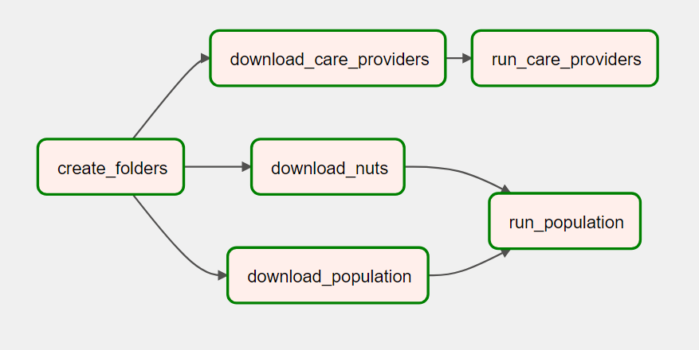

## Requirements
- Python 3, ideally 3.10
- `rdflib` and `apache-airflow` modules

## Description
- Scripts for datacube creation are the same as in the first assignment, with the exception that they now take `output_dir` as an argument in `main`.
- The DAG is set so that it first creates directories for data and for output. After that, it downloads the required data files, and runs the scripts to create the datacubes.

